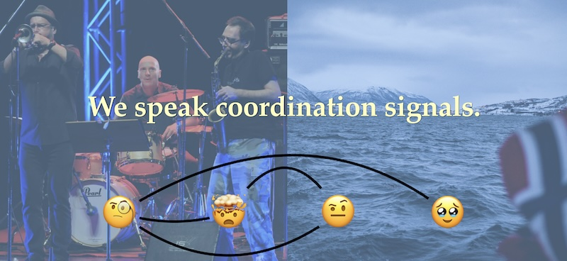

**The Tuning Meditation** is a “text score” by American composer Pauline Oliveros. It has no musical notes. Instead, written instructions explain how participants should create tones from their imagination, sing them out loud, and then alternate between singing new tones and matching the tones being made by others. Here's the score as it appeared in my slides and below in plaintext:

> Using any vowel sound, sing a tone that you hear in your imagination. After contributing your tone, listen for someone else's tone and tune to its pitch as exactly as possible.
> 
> Continue by alternating between singing a tone of your own and tuning to the tone of another voice. Introduce new tones at will and tune to as many different voices as are present. Sing Warmly.
> 
> _(from Deep Listening Pieces by Pauline Oliveros)_

Being familiar with the way conference A/V usually works, when I planned to lead SRECon23 Americas in _The Tuning Meditation_ for my talk [Human Observability of Incident Response](https://youtu.be/bduQmnF-z4Q), I knew this audience participation bit was something the video recording would not be able to capture.

For a long time this thinking prevented me from trying this sort of thing in my other talks, but for whatever reason I decided this was the time to do it. I had come to some personal revelations in my life and it was time to really be myself and own the stage.

## Go to the People

My talk is a tour of how **improvisation** manifests an ingredient of resilient performance: **Adaptive Capacity**. Building this is like building the language of improvisation. It is the discourse of relationships in response to accelerating complexity.

I talk about Signals and how we use them in collaboration, about the things we do during Incidents, and how jazz greats like John Zorn's ensembles are like far-north Arctic rescuers. Also how we can practice for this, just like they do, and be more successful when safety comes to bear.

But I really didn't know how to cold-start this train. I knew that once I got going it would flow, but I needed a catalyst to help get the audience to tune-in without a lengthy pre-talk discussion about the multivariate forms of improvisation.

_We needed a solid way to share common ground, right away._ The night before my talk, I cemented my desire and prepared myself to lead Pauline's piece. It came down to just two things:

1. I wanted to give everyone who journeyed to the conference an opportunity to join together for a memorable experience. Group activities also assist in how well we retain learning!

2. I wanted to provide something more meaningful than metaphor alone. If I could share the experience of [Joint Activity](https://paperswelove.org/2016/video/john-allspaw-common-ground/) with everyone first, then I can point to that and say "that's a Joint Activity, we just did!"
 

## Experimental Reigns

John Cage is known to have said he did not like the term "experimental music" because it implied the music could fail. I think I'd take this a step further and say it isn't the fact that it fails that is unsavory, but that failure itself has a quality of being unwanted. For Cage, failure simply did not exist because the system does what it does. It can't be called experimental.

I didn't know if this experimental intro would fail. I was apprehensive. I have conducted everything from large wind orchestras to small choirs and chamber ensembles, I have performed in a marching band of over 300 people, in operas in front of hundreds, at _The Kennedy Center_ for thousands. I have improvised with groups numbering between two and two hundred. My bands have outnumbered the audience on more than one occasion.

I am used to stepping into situations that are riddled with chances to fail. Embracing the possibility of failure is also how I have witnessed genius occur. But none of this prepared me for the experience of not knowing what would happen when conducting an unsuspecting audience at SRECon.

## Reverberation Hall

It led to an experience I wanted to achieve but had no idea what it would produce. I wasn't expecting the mesmerizing interaction of human song murmuring from floor to ceiling. With the slide above on the screen I began to sing, then others quickly joined, and then more, until the entire auditorium was ringing with hundreds of voices. At sixty seconds, I conducted the piece closed.

The energy we collected propelled the talk with a sailing example of Joint Activity. I could not have hoped for anything better. It was the pinnacle of my musical fixation blending with my passion for resilience and reliability engineering. Immediately, I felt comfortable in my skin, waved over my shoulder to the inner critic sulking in the wings, and launched our train forward.

Looking back on that experience, I know I was leaning on my expertise in adaptation. There have been so many times as a musician that I've sat before the stage before a show, wondering why I do so many strange things, and if the audience will really go for any of this?

I have a lot of trust in my ability to call upon our human powers of Attention and Awareness. If my approach turned out to be a dud and nobody sang, or people laughed, or ducks dropped through the ceiling tiles... it didn't really matter to me, I wasn't preparing for an outcome. I was preparing to make music.

I would do it alone if I had to. An auditorium of beautiful voices showed up instead.

## Fundamental Attention and Awareness

Surprises in our systems can feel like this experience. We cannot sit around coming up with all the ways our systems can fail and then beat ourselves up when The Big One has nothing to do with any of them.

The ways we learn to adapt for the small ensembles and chamber accidents will become emergent and rise to the occasion when symphonic sized challenges push at the envelope of our safety.

> Attention is narrow, pointed, and selective. Awareness is broad, diffuse, and inclusive.
> 
> _- Pauline Oliveros_

In the preface of [Sonic Meditations](https://popandmom.org/collections/pauline-oliveros-collections/products/pauline-oliveros-sonic-meditations), Pauline Oliveros writes that we seek a balance of "steady attention and steady awareness". She goes on to describe the two: "Attention is narrow, pointed, and selective. Awareness is broad, diffuse, and inclusive. [...] Attention can intensify awareness. Awareness can support attention. There is attention to awareness; there is awareness of attention."

We maintain this balance as situations emerge. While playing our instruments, we are attentive to how we play. When making music together, we balance our attention with the awareness of each other.

While we're coordinating together during an incident, we are responsible for the same balance. Not only are we attentive to different points of action, we gain awareness by continuously supporting common ground. As we move through the event, these aspects of what we do shrink and expand like an iris around each of us. 

I use the mandala to describe this relationship. Pauline also uses it to illustrate the concept in her writings, but represented simply by a circle (awareness) surrounding a dot (attention).

I'm really happy I ended up using her example as the corner piece. Balancing Attention and Awareness is essential to the music we make as an integrated socio-technical team, and experiencing that delicate pull together has no better teacher.

---

_This is a revised version of an article I wrote for the defunct Learning From Incidents website._
