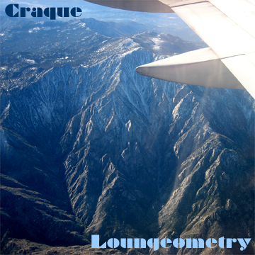
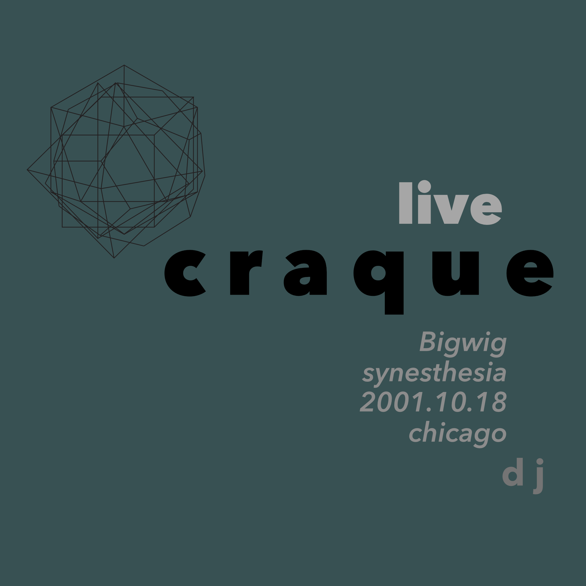

+++
title = "DJ"
description = "Shared sets and other sundries"
author = "craque"
date = "2022-10-24"
layout = "features"
+++

## Sets

### The Collective

A three-hour live DJ set for **The Collective** weekly event (held at _Matador Cantina_ and then _Front Street / Back Alley_, Fullerton CA).

- The Collective (Jun 4, 2018) : [MP3](https://www.dropbox.com/s/m3n3lq2r460fplk/craque-thecollective-192_20180604.mp3?dl=0)

### Loungeometry

Limited edition hand-crafted CD-R release, recorded on two separate nights at the **Loungeometry** weekly event (held at _Kettle and the Keg_ from 2005-2007 in Fullerton, CA).

- Disc 1 : Loungeometry 30 (Nov 30, 2006) : [WAV](https://www.dropbox.com/s/vk8h3qxosbulwc8/1-01%20Loungeometry%2030.wav?dl=0) : [FLAC](https://www.dropbox.com/s/y6u3l7oetsu6cf1/1-01%20Loungeometry%2030.flac?dl=0) : [MP3](https://www.dropbox.com/s/6d47cy6fqbcy2sq/1-01%20Loungeometry%2030.mp3?dl=0)
- Disc 2 : Loungeometry 23 (Nov 23, 2006) : [WAV](https://www.dropbox.com/s/pxyfjm3dbu34gxh/2-01%20Loungeometry%2023.wav?dl=0) : [FLAC](https://www.dropbox.com/s/flguncjm5om6f0l/2-01%20Loungeometry%2023.flac?dl=0) : [MP3](https://www.dropbox.com/s/swg5nk8s8gavcfi/2-01%20Loungeometry%2023.mp3?dl=0)

## Synesthesia

For about a year I was a resident DJ and wacko electro-acoustic IDM artist with this promotion collective, playing at a small but well-furnished club on a corner near Wicker Park. We also did underground and warehouse parties, I performed live for art installations and gallery events quite often; you can hear one of these "live PA" sets on [bandcamp](https://craque.bandcamp.com/album/live-craque-bigwig-synesthesia-i). These are two DJ sets when I played at the club.

### Club Bigwig, 2001.10.18

A very eclectic set that shifts between minimalism, dub, experimental, ambient, and deep house.

- Synesthesia @ Bigwig (Oct 18, 2001) : [WAV](https://www.dropbox.com/s/qqn04o9yqqyjcgz/bigwig-dj-20011018.wav?dl=0) : [FLAC](https://www.dropbox.com/s/w3cpmycw6sx8uqw/bigwig-dj-20011018.flac?dl=0) : [MP3](https://www.dropbox.com/s/8i0m22au7ubuc0o/bigwig-dj-20011018.mp3?dl=0)

### Club Bigwig, 2001.11.08

A rare trip-hop, idm, drum-n-bass, two-step outing. I play stuff like this plenty, but I think this might be the only recording of a full breakbeat set. Later on I started getting much more stylistically diverse.

- Synesthesia @ Bigwig (Nov 8, 2001) : [WAV](https://www.dropbox.com/s/z48dpe6j1h3f2sd/bigwig-dj-dnb-20011108.wav?dl=0) : [FLAC](https://www.dropbox.com/s/aaqgh9emmkjept5/bigwig-dj-dnb-20011108.flac?dl=0) : [MP3](https://www.dropbox.com/s/sbu2jhx0c8v6mk7/bigwig-dj-dnb-20011108.mp3?dl=0)

