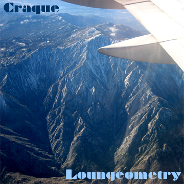

+++
title = "DJ"
description = "Shared sets and other sundries"
author = "craque"
date = "2022-10-24"
layout = "features"
+++

## Sets

### Loungeometry

Limited edition hand-crafted CD-R release, recorded on two separate nights at the **Loungeometry** weekly event (held at _Kettle and the Keg_ from 2005-2007 in Fullerton, CA).
- Disc 1 : Loungeometry 30 (Nov 30, 2006) : [WAV](https://www.dropbox.com/s/vk8h3qxosbulwc8/1-01%20Loungeometry%2030.wav?dl=0) : [FLAC](https://www.dropbox.com/s/y6u3l7oetsu6cf1/1-01%20Loungeometry%2030.flac?dl=0) : [MP3](https://www.dropbox.com/s/6d47cy6fqbcy2sq/1-01%20Loungeometry%2030.mp3?dl=0)
- Disc 2 : Loungeometry 23 (Nov 23, 2006) : [WAV](https://www.dropbox.com/s/pxyfjm3dbu34gxh/2-01%20Loungeometry%2023.wav?dl=0) : [FLAC](https://www.dropbox.com/s/flguncjm5om6f0l/2-01%20Loungeometry%2023.flac?dl=0) : [MP3](https://www.dropbox.com/s/swg5nk8s8gavcfi/2-01%20Loungeometry%2023.mp3?dl=0)

### The Collective
A three-hour live DJ set for **The Collective** weekly event (held at _Matador Cantina_ and then _Front Street / Back Alley_, Fullerton CA).
- The Collective (Jun 4, 2018) : [MP3](https://www.dropbox.com/s/m3n3lq2r460fplk/craque-thecollective-192_20180604.mp3?dl=0)
