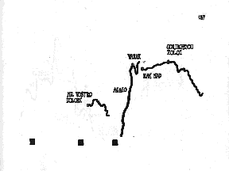

+++
title = "Everybody has a song"
description = "Contrasting vocal improvisation in the music of John Cage and Pauline Oliveros."
author = "craque"
layout = "essay"
+++

_Author: Matthew Ross Davis_  
_Advisor: Dr David Patterson_  
_1998 University of Maryland School of Music_  

## Introduction

Throughout their education, classically trained vocalists go through a rigorous ritual of courses on pedagogy, interpretation, and technique, but rarely do they concentrate on their own musical creativity through improvisation. Singers are so often taught only how to literally interpret the score that when the opportunity arises to deviate from the written music, they either do not know where to turn or do not have the courage to try something new, and the result is to fall back on old habits (what they've heard on a recording, no doubt) and formulae imposed on them by vocal coaches. Embracing the benefits of improvised music will not only enable a singer to explore their own creativity more fully and with better results, but can also shed new light on approaches to music before the 20th Century which involved improvisation to a much greater extent than many people are willing to admit.<A HREF="#footnote1">1</A>

To examine aspects and advantages of extemporaneous music making, this paper focuses on the methods of vocal improvisation being used in contemporary art music. Two pieces illustrate this: John Cage&#146;s _Solo for Voice 52_ from _Song Books_ and Pauline Oliveros's _Approaches and Departures &#150; Appearances and Disappearances for Solo, Duo or Ensemble_. In _Solo for Voice 52_, improvisation can be used as a tool for interpreting the indeterminate, graphic score, where pitch and rhythm are only generally indicated. In _Approaches and Departures_, only prose instructions are given, providing strategies for sounding. Oliveros builds improvisation into her work as an essential component, the purpose being to open the performer's mind to new possibilities and experiences. 

First, improvisation is a tool for exploration and experimentation. Through its use, a singer can discover new things about themselves and their voice which may not have been previously known. Secondly, improvisation engenders a sense of personal accomplishment through creative response to an immediate situation, enriching the performer's sense of the &quot;now&quot; aspect in performing music while being in touch with the surrounding sonic environment.

## Solo for Voice 52

<pre>
    Everybody         has a  song

    which is  no               song at all :

    it is a process          of  singing   ,

         and when you sing  ,

    you are   where you are  .<A HREF="#footnote2">2</A>
</pre>
 
In 1970, John Cage published the monumental _Song Books_. These 90 solos for voice (numbered 3&#150;92, because they are a continuation of _Solo for Voice 1_ and _Solo for Voice 2_<A HREF="#footnote3">3</A>) are collected into four categories (song, song using electronics, theatre, theatre using electronics), and marked as either relevant or irrelevant to the subject &quot;We connect Satie with Thoreau.&quot; Cage specifies in the introduction to the score that the solos may be performed by one or more singers at a time, and that any number of solos may be used in any superimposition possible.<A HREF="#footnote4">4</A>

_Solo for Voice 52_ (subtitled &quot;Aria No. 2&quot;), listed in the score as relevant to the subject of Satie and Thoreau, is reminiscent of the compositional style of _Aria_ (1958).<A HREF="#footnote5">5</A> However, whereas _Aria_ was composed using superimposed transparencies (the same used for _Fontana Mix_<A HREF="#footnote6">6</A>), _Solo 52_ follows the example of _Atlas Eclipticalis_ (1961) by using star charts<A HREF="#footnote7">7</A> to guide the placement of points on the page. These points are translated into a series of organic contours (see Fig. 1), suggesting pitch vertically and time horizontally. The singer manually colors the lines according to numbers preceding each (see Table I), and assigns a different vocal style to each color, performing the piece with as many contrasting styles as possible. A series of black squares also appear periodically between the contours, indicating that some type of noise should be made, vocal or non-vocal. The text of the score consists of words, vowels, and consonants taken from the Armenian, Russian, Italian, French, and English languages. The French and English texts are from sources relevant to Satie and Thoreau.<A HREF="#footnote8">8</A> Further instructions indicate that the solo may be performed with other indeterminate works, referring the performer to some of Cage's own pieces.<A HREF="#footnote9">9</A>

 
<B>Figure 1.</B>  
<I>The first page of the score for &quot;Solo for Voice 52 (Aria No. 2)&quot;</I>

_Solo 52_ presents many practical obstacles to the performer, not the least of which is arriving at ten contrasting vocal styles. Many parts of the performance like this can (and should) be planned ahead of time, and over several performances the version that a particular vocalist constructs begins to take on its own character according to the styles chosen. However, many parts of the score can be approached improvisationally, and doing so will give the singer more insight into what possibilities lie within both the music and themselves.

When interpreting Cage&#146;s music, there are always two aspects of the score which must be carefully considered: what is explicitly indicated, and what is not. We know from the score that &quot;the aria may be sung in whole or in part to provide a program of a determined time-length,&quot;<A HREF="#footnote10">10</A> contours represent pitch on the Y axis and time on the X axis, different colors represent different styles of singing, black squares represent noises, and that &quot;all aspects of a performance (dynamics etc.) which are not notated may be freely determined by the singer.&quot;<A HREF="#footnote11">11</A> It is quite possible for a performer to take the score and predetermine every possible event, writing in pitch-ranges (or even precise pitches), specific time lengths, pronunciations, noises and silences. What is proposed here is that the score can become an avenue for the vocalist to discover, through improvisation, new ways of thinking about their voice and their approach to music as an organization of sound; liberating previous notions of what music can be. Furthermore, improvisatory exploration of this work seems natural and compatible with Cage&#146;s compositional intentions, which focus on asking questions rather than providing answers.

**Table I.** _Notational Elements in &quot;Solo for Voice 52 (Aria No. 2)&quot;_
<PRE>
   Contiguous Contours with 1 style             12
   Contiguous Contours with 2 styles            12
   Contiguous Contours with 3 styles             4
   Contiguous Contours with 4 styles             2
   Contiguous Contours with multiple styles     18
   Styles labeled &#145;1&#146; (solid black)    4
   Styles labeled &#145;2&#146; (dotted line)    5
   Styles labeled &#145;3&#146; (dark blue)     14
   Styles labeled &#145;4&#146; (red)            4
   Styles labeled &#145;5&#146; (purple)         5
   Styles labeled &#145;6&#146; (yellow)         6
   Styles labeled &#145;7&#146; (green)          5
   Styles labeled &#145;8&#146; (orange)         3
   Styles labeled &#145;9&#146; (light blue)     2
   Styles labeled &#145;10&#146; (brown)         7

   Contiguous Contours (Total)                  30
   Black Squares (Total)                        10
</PRE>

Preparations for _Solo 52_ should center around the choice of singing style for each color. An effective performance of the work will contain contrasting styles, since one contour often contains multiple colors, affecting an extreme timbral modulation in the flow of the music. Specificity is important because it is possible for the style to be placed in a situation where the singer will have to experiment to find out what characteristics of the style can be applied. For example, a male singer might choose to use &quot;falsetto&quot; as a style, but may come across a contour reaching below his comfortable falsetto range. He will either need to adjust the pitch-range with which he is working, or experiment with how the falsetto-sounding voice can be translated into his lower tessitura by breaking apart the characteristics of the style in one place and reassembling them in another. For reasons like this, it is advantageous to choose the styles and experiment _before _the actual performance. The challenge to the singer lies in keeping the style intact despite these changes in tessitura. Additionally, a secure grasp on the characteristics of a style will enable the singer to master quickly the transitions from one style to another when contours contain more than one color (like the second and third contours in Fig. 1). These quick changes are one part of _Solo 52_ which should be practiced before performance so that they can be executed with precision and confidence.

Moving slowly but surely away from determinacy, the black square noises offer the most diversity, since they can either be completely programmed beforehand or chosen extemporaneously. The wonderful thing about these events are that Cage leaves them completely open to the imagination of the performer, stating that they may include &quot;&#145;unmusical&#146; use of the voice, auxiliary percussion, mechanical or electronic devices.&quot;<A HREF="#footnote12">12</A> When premiering _Aria_ in 1959, Cathy Berberian (to whom _Song Books_ is dedicated, along with Simone Rist<A HREF="#footnote13">13</A>) used only noises available on her person, including alternate uses of the voice.<A HREF="#footnote14">14</A> This author has performed _Solo 52_ using everything from sheets of paper and African percussion to electronic noises and children&#146;s games. A possible solution might be to have a table with more than enough noise sources to choose from, and deciding _ad libitum_ which ones to use while performing.

The text of _Solo 52_ presents some curious problems in that much of the text consists of only single letters. Pronouncing a solitary letter of the alphabet is something with which the performer will need to deal creatively. There are two choices: 1) pronounce the letter nominally, or 2) pronounce the letter phonetically. The first time this appears in _Solo 52_ is on page 187 of the score (Fig. 1), where the letters &quot;A-E-A-E-O&quot; appear against a long line moving upward. One responsibility of the resourceful improviser is to have an arsenal from which to choose solutions to a problem.<A HREF="#footnote15">15</A>  Therefore, the singer will want to come up with a large array of ways to pronounce each of these letters, and later call upon members of that array during performance. The matter becomes even more complex when the letter can have more than one phonetic pronunciation, and without semantic rules to guide them, the singer will need to decide which one to use. This can become extremely complicated and challenging for the performer. For example, In English, the letter &#145;A&#146; can be pronounced as [e] (rate), [Q] (sang), [a] (bath), [A] (far), [&Aring;] (watch), [&ccedil;] (jaw) or [&acute;] (above),<A HREF="#footnote16">16</A> to cite just one example out of a possible twenty-six! Literally hundreds of phonetic combinations are possible. This particularly dynamic feature of the score molds and shapes the text, creating in live performance the possibility of unpredictable configurations.

In most cases, the performer must also decide when in time to change from one letter to the next. There are some very short contours which fill the space of the accompanying text very nicely, but in cases such as the example above, there is nothing indicating when along the lines certain vowels and consonants are supposed to be sounding, nor when they should change. This is another opportunity for the performer to explore possibilities over the course of several performances. Doing so can make the same words sound completely different from one time to the next, giving the piece a freshness and unpredictability.

Pronouncing the words that are very obviously part of one language or another is fairly straightforward. However, not every singer in the world will be familiar with all the languages present in _Solo 52_, and some choices will need to be made concerning the pronunciation of words in these languages. Cage gives no help, since he does not indicate from which language certain words (or letters, for that matter) are derived. One solution is to pronounce those words in recognizable languages as they would be pronounced normally, and use a syllabic pronunciation (or best guess) for others. Conversely, since Cage is not concerned with music communicating anything,<A HREF="#footnote17">17</A>  the comprehensive significance of properly pronounced words is no longer valid. Considering this, the performer may choose not to sing _any_ of the words as they would be pronounced in their respective languages, even though the disconnected meanings of the words make for an interesting semiotic (as well as sonic) collage.

Once one has reconciled the styles one has chosen with the words and letters to which the style must be applied, it is time to consider the actual material of the performance. At first glance, the contours with which the performer must work suggest a glissando approach to pitch, but Cage explicitly states that pitch and time (time being a combination of tempo and rhythm) is &quot;roughly suggested rather than accurately described.&quot;<A HREF="#footnote18">18</A> A strictly accurate interpretation of the contours would be to sing each one as a continuous glissando, since unbroken contours suggest an unbroken vocal line and unpunctuated rhythm. Cage opens up the interpretation of his work by using these lines to suggest what sequences of pitches should occur in time. By divorcing the score from the musical staff (which Cage did for the first time in a vocal work with _Aria_<A HREF="#footnote19">19</A> and subsequently here with _Solo 52_), Cage similarly disposes of all traditional ideas of pitch-location and range, therefore further freeing the singer to make creative decisions about what those pitches can be. Through improvisatory exploration and experimentation, the singer can discover solutions appropriate to this situation. The singer will first need to decide what pitch range will be used. On paper, the contours cover most the vertical area of a landscape, 8.5&quot;x11&quot; page, leaving about an inch and a half on the top and bottom margins, with about five and one half inches remaining on which to impose a pitch range. This can be daunting considering that singers are used to seeing a pitch range which, in most standard notation, covers barely an inch! The best solution is to treat each contour&#146;s pitch range as relative to another&#146;s, continuing the idea of their being suggestive of pitch instead of absolute indicators.

The selection of pitches and rhythms in performance is probably the easiest part of performing _Solo 52_. The singer will want to know beforehand how to treat certain pitch ranges in relation to the style being sung at the time, but actual pitches themselves can certainly be left up to spontaneity. Along with rhythm and tempo, this is the most genuinely improvisatory part of singing _Solo 52_. Not only can the singer improvise pitches and their placement in time, but the whole range of dynamics and articulations available to the prepared improviser will make for an exciting exploration of the piece as it is being performed.

There is a question that surfaces about the nature of tonality in the work. Obviously, Cage was not concerned about pitches; he only very generally suggests what they should be. His intentions along these lines are unclear, because he does not tell the performer what kind of tonality the work should have, if any. Cage did not shun tonality altogether (he found Erik Satie&#146;s music very beautiful,<A HREF="#footnote20">20</A> and many of his pieces&#150;some included in _Song Books_&#150;reflect Satie&#146;s modal tonality), but it is safe to say that the purpose behind writing vocal works like _Solo 52_ was to explore the possibilities of the voice as a maker of sounds, not the performer as an inventor of tonality.<A HREF="#footnote21">21</A> The vocalist&#146;s challenge lies in the juxtaposition of style, and if tonality helps to confront that challenge, then it is certainly a valid performance choice. This is however, not to mean that the singer has license to do whatever they wish.<A HREF="#footnote22">22</A> 

Concurrent with performing the contours as a series of indeterminate pitches and rhythms and the black squares as noises, the soloist must also contend with placing these events in time according to their spacing on the page. Since Cage specifies that the horizontal scale is of time, the performer must also pay attention to the various empty spaces which fill the score between events. The score for _Solo 52_ is fairly dense, spreading forty some events through a total of eight pages, and not many prolonged silences occur (the most significant one is on the second page of the score, where half the page is blank, followed by two contours of about equal length). Since Cage does not provide a scale of minutes and seconds with the score, the performer can improvise when the events happen in time.<A HREF="#footnote23">23</A> 

The kind of improvisation used in a piece like _Solo for Voice 52_ involves the creativity of the vocalist to the extent that they must solve notational problems within the confines of a composer&#146;s instructions. Improvisational activity like this can be said to be highly structured improvisation, almost to the point of not being improvised. Regardless of the fact that individual choices might change from person to person and from performance to performance, the fact remains that a piece like _Solo 52_ will be recognizable.

Consider _Solo 52_ in terms of Cage&#146;s own definitions of structure (divisibility of the whole into parts), form (content and continuity), method (the means by which continuity is controlled), and material (sound and silence).<A HREF="#footnote24">24</A> The general structure of _Solo 52_, with its 30 contours and 10 squares, is constant and never changes. Some material, such as pitch range, timbre modulation, and relative placement in time, is also explicit. Cage would probably choose to describe the remainder of the score as a &quot;composition which is indeterminate with respect to its performance.&quot;<A HREF="#footnote25">25</A> The vocalist provides form (or &quot;the morphology of the continuity&quot;<A HREF="#footnote26">26</A>) by how he or she pieces these parts together to create the whole. Methods by which this is done (e.g., placement of events in time) and remaining aspects of materials which are not prescribed in the score (frequency, timbre, amplitude and duration<A HREF="#footnote27">27</A>) are both left to the facilities of the performing musician. Since no tradition of performance exists for this genre of music making, improvisation, whether in preparation or performance, becomes a necessary solution to that which is indeterminate. One might think that indeterminate materials would render a piece unrecognizable, but the genius of juxtaposing ten different singing styles in very specific configurations enables the piece to have its own character independent of the performer. The meshing of partially determined materials with specific structures not only calls for a new kind of virtuosity in performance, but also makes the piece unique without constraining its sonic results. It is because of this uniqueness that we can examine _Solo for Voice 52_ as a piece that stands on its own, and not just a &quot;reworking&quot; of _Aria_.<A HREF="#footnote28">28</A>

It is evident that the improvisational activities in _Solo 52_ as outlined above are guided by indications from the score, not solely by the performer's personal preferences (some of which are unavoidable, since we can only know about styles of singing through our own experience). John Cage has been noted as being fundamentally against improvisation: &quot;For Cage, improvisation, in which the creator is present in every detail, was the worst of all options.&quot;<A HREF="#footnote29">29</A> This is not exactly true. Though Cage has said that improvisation &quot;depends more on your likes and dislikes&quot; and that &quot;it doesn't lead you into a new experience, but into something with which you're already familiar,&quot;<A HREF="#footnote30">30</A>  he has also expressed an interest in improvisation as a pathway to discovery: &quot;the reason I had not been interested [in improvisation] was because one just goes back to one's habits. But how can we find ways of improvising that _release_ us from our habits?&quot;<A HREF="#footnote31">31</A> It is through this mode of thinking&#150;releasing one's habits&#150;that improvisation is related to the performance of _Solo 52_. Michael Bach, a cellist who worked with Cage during the last year of his life, discussed approaching technical problems of Cage&#146;s music in very similar ways, forcing him to think differently about the solution.<A HREF="#footnote32">32</A> Improvisation can be used as a tool for discovering the solutions to these problems, and in the actual performance, help the singer uncover new facets of the piece which were before unknown. The challenge to the creative musician is to forego personal preferences and disregard familiar patterns and associations typical of the stylized improvisation which Cage admonished. With _Solo 52_, the performer can experience a kind of music making that is like reaching into the fog and continually asking questions. This is the kind of music making which Cage embraced.

## Approaches and Departures

<PRE>
    The earth is also sound
    guided by sound
    and so are all things of the earth

    Rocks are her ears recording all of her events from the beginning
    My earth body returns to hers
    where the earth worm also sings<A HREF="#footnote33">33</A> 
</PRE>

The self-expressivity normally associated with improvisation was the biggest reason why Cage disliked it so much. He aimed to completely dislodge music from the personal preferences of composer and performer alike, thereby ruling out any expressive spontaneity. In his later years, he found a way to accept improvisation as a performance tool by capitalizing on the unpredictability of natural objects (where a performer's intentions cannot predict what the instrument's response will be, giving an unintended result), such as water-filled conch shells in _Inlets_ and amplified plant materials in _Child of Tree_.<A HREF="#footnote34">34</A>

In stark contrast, Pauline Oliveros became directly involved in improvisational activity,<A HREF="#footnote35">35</A> using it as an explorative device for personal creativity and a way of connecting with the same &quot;bioenvironmental sounds&quot;<A HREF="#footnote36">36</A> which Cage discovered using natural objects. Oliveros shares the same kind of sonic discovery that Cage did, and her scores are meant to encourage this kind of discovery through performance as _Solo 52_ does, but her focus is as much on each performer's personal creativity and interaction with the soundscape as it is on the musical result.

In 1994, Oliveros composed a work called _Approaches and Departures &#150; Appearances and Disappearances for Solo, Duo or Ensemble_.<A HREF="#footnote37">37</A> Like the works contained in _Sonic Meditations_ (Smith Publications, 1974) and _Deep Listening Pieces_ (Deep Listening Publications, 1990), the score contains only prose instructions for making sounds (or &quot;sounding&quot;), and provides the following summary of options (the brackets are editorial):

<BLOCKQUOTE>
 Approach a selected pitch [which includes sounding the pitch]

 Depart from a selected pitch

 Play an approach without sounding the selected pitch [the pitch is imagined]

 Play a departure without sounding the selected pitch

 Just listen<A HREF="#footnote38">38</A> 
</BLOCKQUOTE>

First the performer chooses one pitch for the duration of a single performance. Then, the performer may choose one of the above strategies for sounding, repeating strategies at will for the duration of the performance. The score asks for the pitch to be approached and departed from in as many unique ways as imaginable, &quot;distinctly different in style and elements.&quot; No specific duration is given, and Oliveros further states that when the pitch is reached after an approach (if it is to be sounded), it can be held &quot;short or long just so long as it is the last pitch after each approach.&quot;<A HREF="#footnote39">39</A> This implies that an approach followed by the pitch cannot be followed immediately by a departure from that instance of the pitch. In this case, the pitch must simply be the last sound heard.

Such deceptively simple instructions have the ability of creating a complex musical texture, especially in an ensemble situation. Even with just two or three performers, the sounds created can be various and extreme. A wonderful aspect of the work is that its freedom allows for both spaciousness and denseness within the scope of a single performance. However, Oliveros is quite explicit in stating what can be done and how it should be interpreted, namely that a single pitch is involved for nearly every action the performer can make. Again, like _Solo 52_, it is possible for the performer to plan every second of what they are going to do by mapping out durations and choices, but this does not follow Oliveros's philosophy of listening and responding present in her _Sonic Meditation_ and _Deep Listening Pieces_:

<BLOCKQUOTE>
As a musician I am interested in the sensual nature of sound, its power of release and change. In my performances throughout the world I try to transmit to the audience the way I am experiencing sound as I hear it and play it in a style that I call <b>deep listening</b>.<A HREF="#footnote40">40</A> 
</BLOCKQUOTE>

Since this score so closely resembles her other meditative works, it is reasonable to assume that her ideas of &quot;deep listening&quot; apply to this piece. This requires that its performance be pursued in an extemporaneous manner, involving the performer in a real time sonic exploration of both the sonic environment and themselves:

The central concern in all my prose or oral instructions is to provide attentional strategies for the participants. Attentional strategies are nothing more than ways of listening and responding in consideration of oneself, others and the environment. The result of using these strategies is listening. If performers are listening then the audience is also likely to listen.<A HREF="#footnote41">41</A> 

An important part of her philosophy in deep listening is the spontaneous reaction to and absorption of environmental awareness and internal attention; &quot;sound and hearing, both active and receptive, are the foci of attention and stimuli of awareness.&quot;<A HREF="#footnote42">42</A> The term 'sonic awareness' has been used to describe this meditative approach to improvised music as &quot;the ability to consciously focus attention upon environmental and musical sound.&quot;<A HREF="#footnote43">43</A> The relationship between attention and awareness is symbolized by a circle with a dot at its center (see Fig. 2). The circle represents awareness, which is &quot;global, non-linear, and registers sensory, imagined, and remembered information.&quot; The dot represents attention, which is &quot;focal, occupied with singular or sequential and linear material.&quot;<A HREF="#footnote44">44</A> Furthermore, the single pitch aspect of _Approaches and Departures_ is especially relevant to Oliveros's fourfold model for sonic awareness: one can make a sound, imagine it, listen to it, or remember it.<A HREF="#footnote45">45</A> 

<B>Figure 2.</B>  
<I>a mandala symbolizing the relationship between attention and awareness</I>

There are some practical considerations to make in preparation for a performance of _Approaches and Departures_, the first being this single pitch. Oliveros does not give any upper or lower limits, so practically anything is possible, but the chosen pitch should lie in a comfortable range, facilitating ease of production and recollection. Octave displacement is not disallowed by the score (though Oliveros does refer to it as a single pitch rather than a pitch-class), but it might be easiest at first to keep with one frequency and not sing octaves until the performer is comfortable with recalling the pitch after having improvised several others.

To complicate the problem of remembering a precise pitch, there are the third and fourth options for performance:

<BLOCKQUOTE>
Approach the pitch in as many ways as possible but do not sound the pitch - hear it mentally (auralize it). This auralization may be as long or short as long as you hear it before you take another approach.

Hear the pitch as internally attacked and leave it as many ways as possible, the mental attack being as long or short as heard then leave it.<A HREF="#footnote46">46</A> 
</BLOCKQUOTE>

The vocalist is required to imagine the same pitch they have chosen to sing without actually singing it, and after many iterations of various approaches and departures (which certainly have the possibility of containing other pitches), this can become quite difficult.<A HREF="#footnote47">47</A> Instrumentalists performing this piece have the luxury of fingering combinations and embouchure that will produce a precise pitch every time,<A HREF="#footnote48">48</A> so for the vocalist this type of improvisational activity can be a special challenge and a study in ear-training.<A HREF="#footnote49">49</A> In the interim (or before the performance), using a tuning fork or similar device to aid with internalizing the pitch before vocalizing might be a solution for someone whose ear-training skills are not as advanced.

At first, there may seem to be an infinite number of ways to approach or depart from a pitch, but in performance the singer's stylistic habits and predilections will surface. The challenge is to incorporate that which is known with that which is unknown, exploring the possibilities and focusing on the uniqueness of each event. Since the piece itself is not constricted by style, the performer need not be restricted to idiomatic improvisation; anything is possible. This kind of method for discovery illustrates one way Cage and Oliveros are related in their attitudes towards improvisation.

As the vocal improviser gains experience through repeated performances and sessions with others, he or she will be able to begin formulating a personal vocabulary of techniques and styles that can be relevant to any particular situation. This happens often when a particular group of improvisers come together regularly, but it is equally important for the soloist to develop a musical language as well.<A HREF="#footnote50">50</A> The performer comes to an improvisational piece with this language intact, and soon is influenced by the language of other participating musicians, the juxtaposition of which hopefully flares the imagination to create something completely new. This is the remarkable aspect of improvised music which cannot be translated into pre-composed forms of music. That which is unpredictable is often that which is most exciting and ultimately rewarding, both for improviser and listener.

Materially, the successful approach to (or departure from) a pitch, sounded or imagined, is a specific one. That is, the vocalist should not fall into the trap of just making arbitrary sounds and justifying them as approaches or departures. Any combination of phonemes, pitches, mouth sounds, slides, glissandi, whistles, or even various extended vocal techniques (reinforced harmonics, ululation, vocal fry, and complex multiphonics, to name a few<A HREF="#footnote51">51</A>) could be used in relation to a pitch, but they should be specifically approaching or departing from that pitch. The sonic result may not reveal to a listener which action is being taken, but the performer should know because it gives them focus and attention on a specific goal, which strengthens any performance, improvised or not.<A HREF="#footnote52">52</A> 

Language is one particular material and texture that could cause some confusion. Because human beings communicate primarily through symbols (i.e. words), semiotics suggests that these symbols carry  connotative meaning, especially when put in the context of grammar and punctuation. To use words while improvising approaches and departures to and from a pitch is admissible (at least by the indications in the score), but perhaps only to a point. Oliveros's intention with this work is not to create semantic meaning through an expression of textual language, but to instead enlighten both performer and audience through the deep listening aspects of the piece, as mentioned above. Again, the objective for each event in the evolution of the performance is to arrive at or depart from a specific pitch which can be sounded mentally or vocally. If a secondary meaning is placed upon the work, then this meditative nature of the piece may fade into the background, a result which Oliveros could not have wanted. However, if words are used in such a way that significant meaning cannot be extracted from them, then this problem is averted, and language can serve the goals of approaching and departing. This can be accomplished by using unrelated phonemes or gibberish, or juxtaposing letters and words to create a collage of sound (much like Cage does with the text of _Solo 52_). In an ensemble situation, this could mean recognizing the use of words by someone else and thickening the texture by adding an additional layer of words, thereby blurring comprehension.

This kind of ensemble work emphasizes the global aspect of approaching and departing (the outer circle of the mandala) by bringing into play what another performer (or the environment) is adding to the performance, and activating a creative response from the performer who perceives this. For instance, the way one singer approaches their pitch might illuminate a completely different way of approaching a pitch for someone else. Environmentally, sounds from sources other than the performers would necessarily change the way the entire sonic picture is perceived, and might even inspire a particular approach or departure. The sounding space itself may have certain resonance characteristics which color the way listeners perceive the soundscape, in turn changing the way performers treat their sounding.

One might compare these ideas with how the stage actor uses improvisation as a tool to make adjustments to their movement and speech, and how different adjustments are applicable depending on the nature of the circumstance, be it internal (emotional, personal) or external (physical, environmental).<A HREF="#footnote53">53</A> If the performer is receptive to these circumstances in a spontaneous way, then discoveries are made which give insight to both the character and the actor, free from preconceived notions and habits; &quot;it is the time of discovery, of experiencing, of creative expression.&quot;<A HREF="#footnote54">54</A> It is no accident that Konstantin Stanislavski's revered principles of acting center around &quot;inspirational improvisation.&quot;<A HREF="#footnote55">55</A>

In Oliveros's pieces, similar emphasis is placed upon the enlightenment and personal creativity of the performer:

<BLOCKQUOTE>
My music is interactive music. It is interactive in the sense that participants take a share in creating the work rather than being limited to expressively interpreting pitches and rhythms. I have composed the outside forms, the guidelines for ways of listening and ways of responding. These forms and guidelines with appropriate application give the participants a creative opportunity to compose and perform simultaneously in collaboration with me and to expand their musicianship.<A HREF="#footnote56">56</A> 
</BLOCKQUOTE>

Oliveros wants &quot;to get performers involved in creative process.&quot;<A HREF="#footnote57">57</A> Mindful improvisation becomes a doorway to enlightenment, and to the vocalist it is especially poignant because singers must deal with their own instrument in such a deep, psychological way. The voice is not only the mechanism for creating music, but is also part of the person. _Approaches and Departures_ encourages the kind of interactive activity which is a holistic approach to creation and a necessary departure from limitation, ultimately freeing both the mind and the voice.

## Conclusion

The fundamental difference between these two pieces is where the emphasis is placed by the composer. With Cage, the emphasis is primarily the sonic result and the music as it stands on its own, exploring the voice as a creator of new sounds. With Oliveros, the sonic result is important, but equally so is the individual who is making the sounds and how that relates to their own personal creativity and interaction with the environment. Neither piece is concerned with linguistic, semantic meaning. On the one hand, Cage uses individual letters and words in different languages that hold not even the most abstract relationship to each other in terms of comprehension. On the other, no text whatsoever exists for _Approaches and Departures_.

Within the context of performance practice, Cage&#146;s piece can be considered a highly structured improvisation. Imagine a scale of improvisation solubility, where the method by which questions of form and material are answered with relation to the score is colored by the concentration of improvisation in the solution. _Solo 52_ would sit further to the less-dense side of necessary improvised activity, while other works, like _Approaches and Departures_, move further and further away to the point of there being no score at all; indeterminate aspects of the work become more and more numerous, and to the artist, more and more challenging.

The vocalist must be prepared for what this music will require, and different pieces along this scale will emphasize different methods and styles of vocal improvisation according to the composition's needs. A piece like _Solo 52_ helps train the singer for these possibilities in a controlled situation, challenging  personal creativity to solve specific performance problems. _Approaches and Departures_ provides a similar experimental situation, but emphasizes this exploration as a process of performing and learning about personal creativity while listening and responding.

Over the past several hundred years, the role of the vocalist as a creative musician and collaborator of ideas has slowly deteriorated. Improvisation is no longer an emphasized and integral part of being a musician.<A HREF="#footnote58">58</A>  Although the importance of interpretation skills and healthy singing should never be diminished, it is essential to the maintenance of creative musicianship for all performers, singers and instrumentalists alike, to learn the discipline and benefits of original improvisation. This is not simply learning riffs and ornaments associated with the music being performed. It is a matter of confronting the musical mind with the idea of creating art, and not just repeating art.

## Notes

 <A NAME="footnote1">1</A> See Larry Solomon, &quot;Improvisation I,&quot; <I>Perspectives of New Music</I> 21:i-ii (1982-83), 71-78. and &quot;Improvisation II,&quot; <I>Perspectives of New Music</I> 24:ii (1986), 224-35.

 <A NAME="footnote2">2</A> John Cage, &quot;Lecture on Nothing&quot; (1959), <I>Silence</I> (Middletown: Wesleyan Univ. Press, 1961), 126.

 <A NAME="footnote3">3</A> James Pritchett, <I>The Music of John Cage</I> (New York and Cambridge: Cambridge Univ. Press, 1993), 166.

 <A NAME="footnote4">4</A> John Cage, <I>Song Books: Solos for Voice 3-92</I> (New York, London and Frankfurt: C.F. Peters Corporation, Henmar Press Inc., 1970), 1.

 <A NAME="footnote5">5</A> Pritchett, 167.

 <A NAME="footnote6">6</A> ibid.

 <A NAME="footnote7">7</A> ibid.

 <A NAME="footnote8">8</A> Janetta Petkus, <I>The Songs of John Cage (1932-1970)</I> (Ph.D. diss., Univ. of Connecticut, 1986), 214-15. Specific examples include nature observations by Thoreau and a comment by Satie after a poor reception of <I>Socrate</I>: &quot;Etrange, n&#146;est pas?&quot; (&quot;Odd, isn&#146;t it?&quot;). Each solo listed as &quot;relevant&quot; has either Satie or Thoreau behind it in one way or another. (Pritchett, 191.)

 <A NAME="footnote9">9</A> <I>Fontana Mix</I> and <I>Concert for Piano and Orchestra</I>. These works can be described as compositions whose final outcome cannot be determined by simply observing the score, which is also true of <I>Solo 52</I>. For a discussion on indeterminacy, see John Cage, &quot;Composition as Process&quot; (1958), <I>Silence</I>, 35.

 <A NAME="footnote10">10</A> Cage, <I>Song Books</I>, 186.

 <A NAME="footnote11">11</A> ibid.

 <A NAME="footnote12">12</A> Cage, <I>Song Books</I>, 186.

 <A NAME="footnote13">13</A> Cage, <I>Song Books</I>, I.

 <A NAME="footnote14">14</A> Petkus, 139-140. These included a foot stomp, snapping of fingers, pained inhalation, a scream, and an expression of sexual pleasure. Also noted is how this choice could be related to the fact that for its premiere, <I>Aria</I> was performed along with <I>Fontana Mix</I>.

 <A NAME="footnote15">15</A> See Derek Bailey's discussion of an 'improvising language.' [Derek Bailey, <I>Improvisation: Its Nature and Practice in Music</I> (New York: Da Capo Press), 106.]

 <A NAME="footnote16">16</A> Bracketed symbols refer to IPA (International Phonetic Alphabet), a chart for which can be found in <I>A Pronouncing Dictionary of American English</I>, xvii, by John Samuel Kenyon and Thomas Albert Knott.

 <A NAME="footnote17">17</A> A position well established by 1952, several years before both <I>Aria</I> and the solos from <I>Song Books</I> were written. [David Patterson, <I>Appraising the Catchwords, c. 1942-1959: John Cage's Asian-Derived Rhetoric and the Historical Reference of Black Mountain College</I> (Ph.D. Diss., Columbia Univ., 1996), 102.]

 <A NAME="footnote18">18</A> Cage, <I>Song Books</I>, 186.

 <A NAME="footnote19">19</A> For a discussion of the compositional procedures used in <I>Aria</I>, see Petkus, <I>The Songs of John Cage</I>, 135-142.

 <A NAME="footnote20">20</A> John Cage with Joan Retallack, <I>Musicage: Cage Muses on Words Art Music</I> (Middletown: Wesleyan Univ. Press, 1996), 165.

 <A NAME="footnote21">21</A> Petkus, 138. She points out that the virtuosic vocal demands of <I>Aria</I> (and therefore <I>Solo 52</I>) were most certainly influenced by the abilities of Cathy Berberian, who at the time was married to Luciano Berio. Revill suggests that Cage was the first to see this talent in Berberian, encouraging Berio to begin work on what would become <I>Circles</I>. [David Revill, The Roaring Silence: John Cage: A Life (New York: Arcade Publishing, 1992), 193.]

 <A NAME="footnote22">22</A> &quot;Permission granted. But not to do whatever you want.&quot; [John Cage, &quot;Seriously Comma&quot; (1966), <I>A Year from Monday</I> (Middletown: Wesleyan Univ. Press, 1967), 28.]

 <A NAME="footnote23">23</A> Petkus suggests that each page of such a score takes about 30 seconds to perform. (Petkus, <I>The Songs of John Cage</I>, 140.) Joan La Barbara's recording of <I>Solo 52</I> on the New Albion label is listed at 3'59&quot;, which is an average of 30 seconds per page. This author has performed <I>Solo 52</I> slightly slower (approximately 4'30&quot;).

 <A NAME="footnote24">24</A> Cage, <I>Silence</I>, 62. Although by this time Cage was using chance techniques, his ideas of <I>form</I> and <I>structure</I> had been supplanted by broader notions of &quot;meta-structure&quot; and the &quot;now moment,&quot; both exemplified respectively in &quot;Lecture on Nothing&quot; (<I>Silence</I>, 109) and &quot;Lecture on Something&quot; (<I>Silence</I>, 128). See Paterson, <I>Appraising the Catchwords</I>, 232-233.

 <A NAME="footnote25">25</A> Cage, <I>Silence</I>, 35.

 <A NAME="footnote26">26</A> ibid.

 <A NAME="footnote27">27</A> Cage, <I>Silence</I>, 38.

 <A NAME="footnote28">28</A> Petkus states that &quot;Except for a few changes, this is a repeat of Cage&#146;s earlier composition, <I>Aria</I>,&quot; and calls it a reworking of that piece. (Petkus, <I>The Songs of John Cage</I>, 214.) This is a poor choice of words, since Cage did not 'rework' <I>Aria</I> at all, using a different compositional technique (albeit with a similar result) and completely different literary sources. (Pritchett, <I>The Music of John Cage</I>, 167.)

 <A NAME="footnote29">29</A> Michel Ratt&eacute;, &quot;Improvisation as Form,&quot; <I>Resonance</I> (Vol. 6, No. 1, 1997), 28.

 <A NAME="footnote30">30</A> William Fetterman, <I>John Cage's Theatre Pieces: Notations and Performances</I> (Amsterdam: Harwood Academic Publishers), 124.

 <A NAME="footnote31">31</A> Cage and Retallack, <I>Musicage</I>, 274.

 <A NAME="footnote32">32</A> Cage and Retallack, <I>Musicage</I>, 273.

 <A NAME="footnote33">33</A> Pauline Oliveros, &quot;The Earth Worm Also Sings: A composer's practice of deep listening&quot; (excerpt), <I>Leonardo Music Journal</I> (Vol. 3, 1993), 35.

 <A NAME="footnote34">34</A> Pritchett, <I>The Music of John Cage</I>, 194-5.

 <A NAME="footnote35">35</A> Heidi von Gunden, <I>The Music of Pauline Oliveros</I> (Metuchen, NJ and London: The Scarecrow Press, Inc., 1983), 32-33.

 <A NAME="footnote36">36</A> David H. Cope, <I>New Directions in Music, </I>3rd ed. (Dubuque, Iowa: Wm. C. Brown Company, 1981), 284.

 <A NAME="footnote37">37</A> The score states: &quot;February 4, 1994. Composed at the Swiss Institute - New York City during Hildegard Kleeb's performance of Roland Dahinden's installation.&quot; [Pauline Oliveros, <I>Approaches and Departures &#150; Appearances and Disappearances for Solo, Duo or Ensemble</I>, (Kingston, NY: Deep Listening Publications, 1995), 1.] According to a student at Mills College, the premiere performance took place there in 1995 several weeks before the San Francisco Jazz Festival. [Matthew Goodheart, <I>Freedom and Individuality in the Music of Cecil Tayor</I> (Master's Thesis, Mills College, 1997), part III.]

 <A NAME="footnote38">38</A> Pauline Oliveros, <I>Approaches and Departures</I>, 1.

 <A NAME="footnote39">39</A> ibid.

 <A NAME="footnote40">40</A> Pauline Oliveros, <I>Deep Listening Pieces</I> (Kingston, NY: Deep Listening Publications, 1990), preface.

 <A NAME="footnote41">41</A> Pauline Oliveros, &quot;The Roots of the Moment: Interactive Music,&quot; <I>NewMus MusicNet</I> (No. 1, 1995), 6. This essay appeared originally in Pauline Oliveros's <I>Roots of the Moment: Writings, H&ouml;rspiels and Poems 1981-1995</I> (Drogue Press, 1995).

 <A NAME="footnote42">42</A> Pauline Oliveros, &quot;On Sonic Meditation&quot; (1973), <I>Software for People</I> (Baltimore: Smith Publications, 1984), 141. This article was originally published in the <I>Painted Bride Quarterly</I> (Winter 1976, Vol. 3, No. 1).

 <A NAME="footnote43">43</A> Heidi von Gunden, &quot;The Theory of Sonic Awareness in <I>The Greeting</I> by Pauline Oliveros,&quot; <I>Perspectives of New Music</I> (Fall-Winter 1980, Spring-Summer 1981), 409.

 <A NAME="footnote44">44</A> von Gunden, 410.

 <A NAME="footnote45">45</A> von Gunden, 412.

 <A NAME="footnote46">46</A> Oliveros, <I>Approaches and Departures</I>, 1.

 <A NAME="footnote47">47</A> von Gunden likens this to what in Zen tradition is called a &quot;monkey mind,&quot; where the attention and awareness is sporadic and unfocused. (von Gunden, &quot;The Theory of Sonic Awareness in <I>The Greeting</I> by Pauline Oliveros,&quot; 413.)

 <A NAME="footnote48">48</A> It is important to note that Oliveros did originally write <I>Approaches and Departures</I> for instruments. However, she has also expressed pleasure with its interpretation as a work for voices. (Thomas Bickley, email to the author, Jan. 23, 1998.)

 <A NAME="footnote49">49</A> In fact, Oliveros formed a group along with Terry Riley and Loren Rush in 1957 which focused on developing their real time listening skills through free, scoreless improvisation. (von Gunden, <I>The Music of Pauline Oliveros</I>, 33.)

 <A NAME="footnote50">50</A> Derek Bailey, <I>Improvisation</I>, 106.

 <A NAME="footnote51">51</A> Will Ogdon, ed., <I>Reports from the Center</I>, vol. 1, no. 2, <I>An Introduction to Extended Vocal Techniques: Some Compositional Aspects and Performance Problems</I>, by Deborah Kavasch (La Jolla, CA: Center for Music Experiment, UCSD, 1980), 1. The role of extended vocal techniques in an improvisation such as <I>Approaches and Departures</I> is a interesting one, because the singer can explore areas of sounding and experience with their instrument that are not normally ever practiced (and are too extensive to discuss in length here). However, as Kavasch points out in her report (p.12), care should be taken to use a microphone where necessary because some techniques are not projectable without amplification, and could cause the singer to force or strain the voice.

 <A NAME="footnote52">52</A> As Konstantin Stanislavski said, &quot;In general is the enemy of art.&quot; [Sonia Moore, <I>The Stanislavski System: The Professional Training of an Actor</I>, 2nd ed. (New York: Penguin Books, 1984), 23.]

 <A NAME="footnote53">53</A> Oliveros's use of the mandala to exemplify attention and awareness is strikingly similar to Stanislavski's theories of attention and awareness for actors, and he even uses the term &quot;circles of attention&quot; to refer to the hemispheres of awareness surrounding the actor on a stage. [Konstantin Stanislavski, <I>An Actor Prepares</I>, (Routledge and NY: Theatre Arts, Inc., 1989), 81.]

 <A NAME="footnote54">54</A> Viola Spolin, <I>Improvisation for the Theater: A Handbook of Teaching and Directing Techniques</I> (Evanston: Northwestern Univ. Press, 1963), 4.

 <A NAME="footnote55">55</A> Moore, <I>The Stanislavski System</I>, 11.

 <A NAME="footnote56">56</A> Pauline Oliveros, &quot;The Roots of the Moment: Interactive Music,&quot; 6.

 <A NAME="footnote57">57</A> Pauline Oliveros, email to the author, Feb. 3, 1998.

 <A NAME="footnote58">58</A> Ernest Ferand discusses the abilities of singers during the 16th and 17th Centuries to improvise polyphonic music, and there is even evidence to suggest that the well-known <I>Stabat Mater</I> of Josquin des Prez was extemporized counterpoint. See Ernest Ferand, <I>Improvisation in Nine Centuries of Western Music: An Anthology with a Historical Introduction</I>, (Cologne: Arno Volk Verlag, 1961), 7-9.

## Bibliography

### Published Sources

Bailey, Derek. _Improvisation: Its Nature and Practice in Music_. New York: Da Capo Press, 1993.   
Cage, John. _Silence_. Middletown: Wesleyan Univ. Press, 1961.   
\_\_\_. _Song Books: Solos for Voice 3-92_. New York, London and Frankfurt: C.F. Peters Corporation, Henmar Press Inc., 1970. Score.   
\_\_\_. _A Year from Monday_. Middletown: Wesleyan Univ. Press, 1967.   
Cage, John and Joan Retallack. _Musicage: Cage Muses on Words Art Music_. Middletown: Wesleyan Univ. Press, 1996.   
Cope, David H. _New Directions in Music_, 3rd ed. Dubuque, Iowa: Wm. C. Brown Company, 1981.   
Ferand, Ernest T. _Improvisation in Nine Centuries of Western Music: An Anthology With a Historical Introduction_. Cologne: Arno Volk Verlag, 1961.   
Fetterman, William. _John Cage's Theatre Pieces: Notations and Performances_. Amsterdam: Harwood Academic Publishers, 1996.   
Moore, Sonia. _The Stanislavski System: The Professional Training of an Actor_, 2nd ed. New York: Penguin Books, 1984.   
Ogdon, Will (ed.). _Reports from the Center_, vol. 1, no. 2, _An Introduction to Extended Vocal Techniques: Some Compositional Aspects and Performance Problems_, by Deborah Kavasch. La Jolla, CA: Center for Music Experiment, UCSD, 1980.   
Oliveros, Pauline. _Approaches and Departures &#150; Appearances and Disappearances for Solo, Duo or Ensemble_. Kingston, NY: Deep Listening Publications, 1995. Score.   
\_\_\_. _Deep Listening Pieces_. Kingston, NY: Deep Listening Publications, 1990. Score.   
\_\_\_. &quot;The Earth Worm Also Sings: A composer's practice of deep listening,&quot; _Leonardo Music Journal_ 3 (1993): 35-38.   
\_\_\_. &quot;The Roots of the Moment: Interactive Music,&quot; _NewMus MusicNet_ 1 (April 1995): 6-7.   
\_\_\_. _Roots of the Moment: Writings, H&ouml;rspiels and Poems 1981-1995_. Drogue Press, 1995.   
\_\_\_. _Software for People_. Baltimore: Smith Publications, 1984.   
\_\_\_. _Sonic Meditations_. Baltimore: Smith Publications, 1974. Score.   
Patterson, David. _Appraising the Catchwords, c. 1942-1959: John Cage's Asian-Derived Rhetoric and the Historical Reference of Black Mountain College_. Ph.D. dissertation, Columbia Univ., 1996.   
Petkus, Janetta. _The Songs of John Cage (1932-1970)_. Ph.D. dissertation, Univ. of Connecticut, 1986.   
Pritchett, James. _The Music of John Cage_. New York and Cambridge: Cambridge Univ. Press, 1993.   
Ratt&eacute;, Michel. &quot;Improvisation as Form.&quot; _Resonance_ 6:i (1997): 28-31.   
Revill, David. _The Roaring Silence: John Cage, a Life_. New York: Arcade Publishing, 1992.   
Solomon, Larry. &quot;Improvisation I.&quot; _Perspectives of New Music_ 21:i-ii (fall-winter 1982/spring-summer 1983): 71-78.   
\_\_\_. &quot;Improvisation II.&quot; _Perspectives of New Music_ 24:ii (spring-summer 1986): 224-35.   
Spolin, Viola. _Improvisation for the Theater: A Handbook of Teaching and Directing Techniques_. Evanston: Northwestern Univ. Press, 1963.   
Stanislavski, Konstantin. _An Actor Prepares_. Elizabeth Reynolds Hapgood, trans. Routledge and NY: Theatre Arts, Inc., 1936.   
von Gunden, Heidi. _The Music of Pauline Oliveros_. Metuchen, NJ and London: The Scarecrow Press, Inc., 1983.   
\_\_\_. &quot;The Theory of Sonic Awareness in _The Greeting_ by Pauline Oliveros,&quot; _Perspectives of New Music_ 19:i-ii (fall-winter 1980/spring-summer 1981): 409-16.

### Unpublished Sources

Bickley, Thomas. Email to the author. Jan. 23, 1998.  
Goodheart, Matthew. _Freedom and Individuality in the Music of Cecil Tayor_. Master's Thesis, Mills College, 1997.  
Oliveros, Pauline. Email to the author. Feb. 3, 1998.  

## Discography

- <a href="https://commavoices.bandcamp.com">Comma. _(voices)_</a>. Compositions by Pauline Oliveros and John Cage. Metatron Press MPCD101, 1998. Compact Disc. Contains both _Solo for Voice 52_ and _Approaches and Departures_.
- La Barbara, Joan. _Singing Through_. Vocal compositions by John Cage. New Albion Records NA 035, 1990. Compact Disc. Contains _Solo for Voice 52_.

